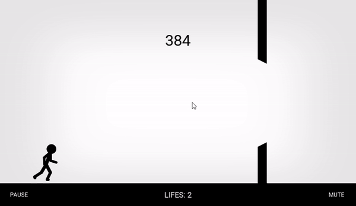
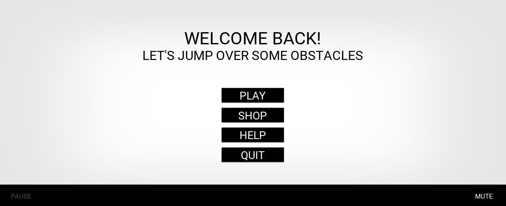
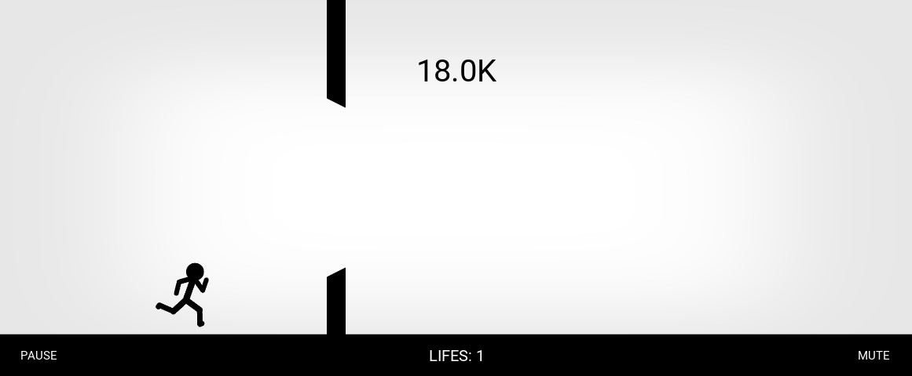
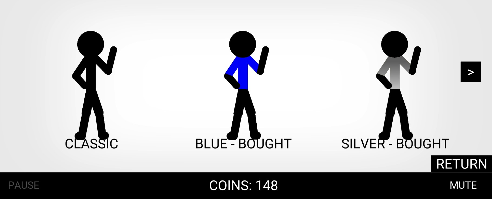
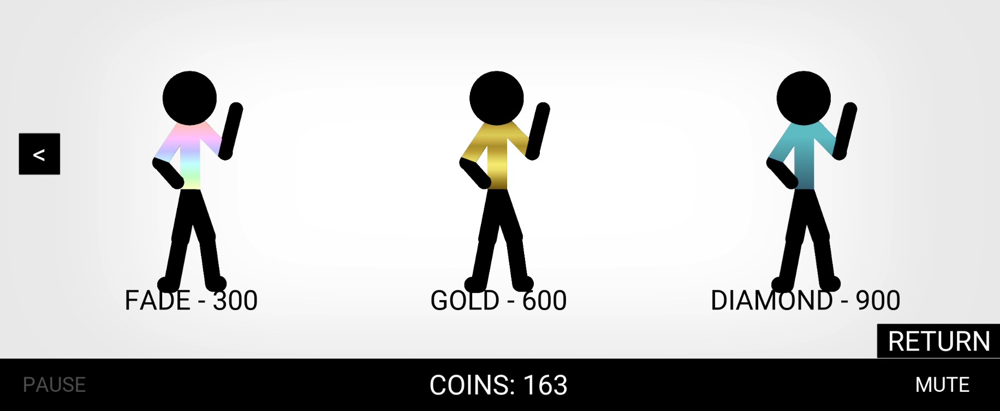

# StickJump

## Table of contents
* [General info](#general-info)
* [Technologies](#technologies)
* [Setup](#setup)
* [Screenshots](#screenshots)

## General info
This project is a game on Android
	
## Technologies
Project is created with:
* Python
* Kivy

	
## Setup
To run this game on your phone [download .apk](https://drive.google.com/file/d/14ds02l-IrrRRxb8CWhjnUv0T0abNHWqz/view?usp=sharing)

## Screenshots
* **Menu**

* **Game**

* **Shop**

